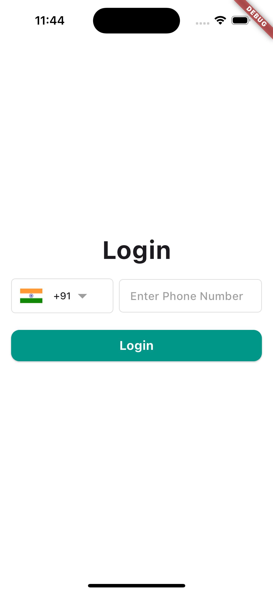
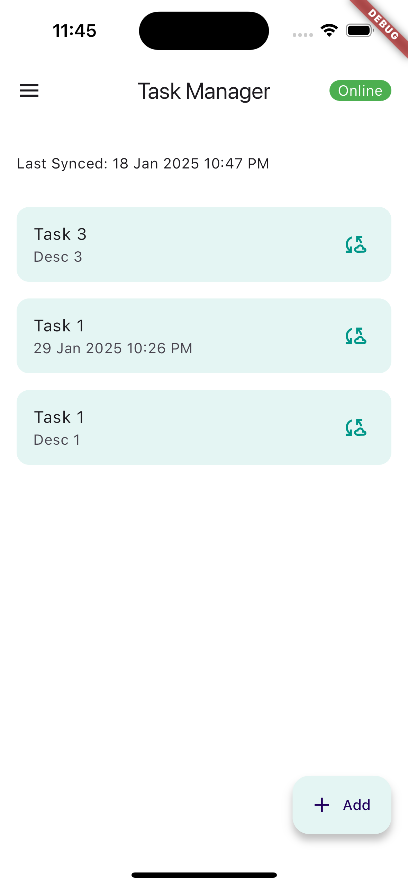
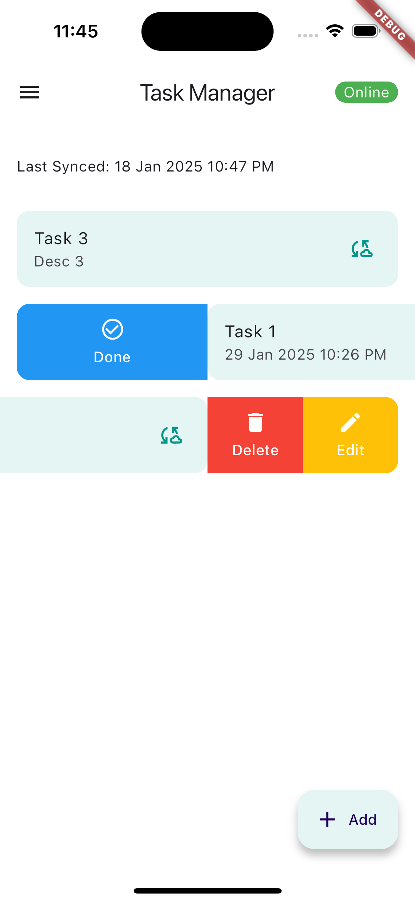
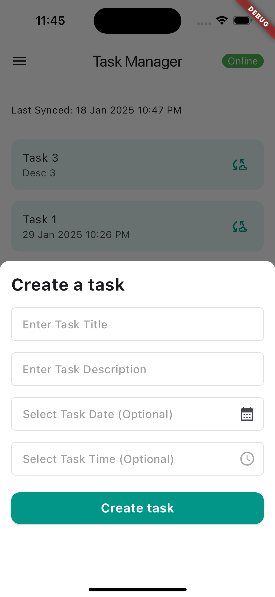

# Tushop Assignment

A simple offline-first Task Management App using Hive as the local storage and Firebase Firestore as the online storage

## Getting Started

### Versions
- Flutter 3.22.3
- Dart 3.4.4

### App Features
- Clean smooth UI
- Firebase Phone Auth with country selector
- Tasks CRUD to Hive
- Synchronization service from Hive to Firebase
- Network connectivity checker
- In-App network toggle
- Internationalization

### Dependencies
- State Management - Riverpod
- Local storage - Hive
- Online storage - Firebase
- Internationalization - internationalization
- Network status - connectivity_plus

### To run the app
- Clone the repo
- Run `flutter pub get`
- Connect simulator/emulator
- Run `flutter run`

## Screenshots

  
  
  
  

